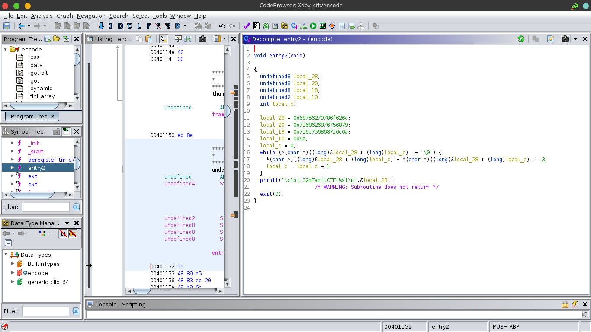
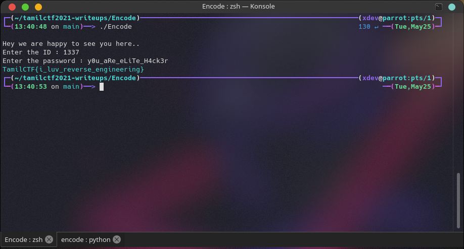

# Encode Challenge
  - We need to find the flag in the format of TamilCTF{flag}. The Encode Binary is in the same directory ,So you download here.

## Analysis the Binary
  - Do some basic analysis on the encode binary.
    - file Encode It is 64 bit, x86-64 and not stripped binary.
    - strings Encode  Nothing is interesting like Flag.
  - Run the binary and analysi the functionality
    - ./Encode  It asking the id ,just enter anything.The output is **The ID is Wrong.**

## Open the binary on Ghidra
  - Ghidra is decompiler,it can decompile the object code and give the c code.
    - /opt/ghidra_9.2.3.PUBLIC/ghidraRun   
  - Examine the main function
    - It print some strings ,then it wait for user input **( ID )** and the user input is compared to 0x539 **(It is hex of 1337)** .So We **find the ID successfully.**   But it ask another user input (password) and it pass user input to pwd function.  After that it call the entry2 function...

  - Examine the pwd function
    - In pwd function, there are many stuff doing here. But I quickly note that In first while loop,decrease 5 char in stored string.  So i decided to find the strings stored in local_78,70 and 62. The value of packed in hexa value.So i unpacked the hexadecimal value by using struct module in python.  Look the first while loop    .So the every single byte of strings **( ~5zdfWjdjQnYjdM9hp8w )** is decrease by 5 times.Then it decode strings is compare to user input,if false the program will **exit** ,  otherwise it return to main function..
  - Examine the entry2 function
    - The entry2 function look like print the flag  

## Make a Decoding Script
  - So, our goal is decrease 5 char in encoded strings **(~5zdfWjdjQnYjdM9hp8w)**  
    - The ord function change the char to decimal **( The ascii value of that char )**.
    - Then the decimal value decrease by 5,The Minus value is change into char by using **chr(int(decimal_value))**.
    - Then print the Decoded value .

## Run the Decode script
  - Run the asd script. 
    - ./asd.py    
    - So We successfully decoded that strings
    - The password is **y0u_aRe_eLiTe_H4ck3r**

## Got the flag
  - Run the encode binary.
    > ./Encode 
  - It know that id is 1337 and password is **y0u_aRe_eLiTe_H4ck3r**   
  - So finally , we got the flag :smiley: 

