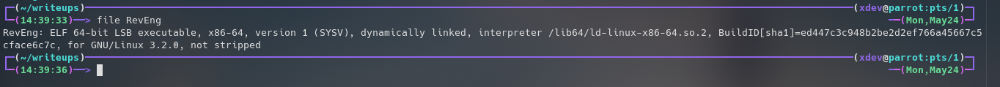
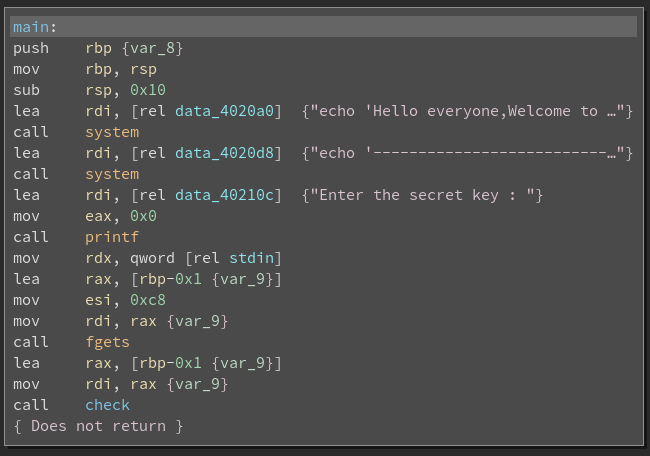
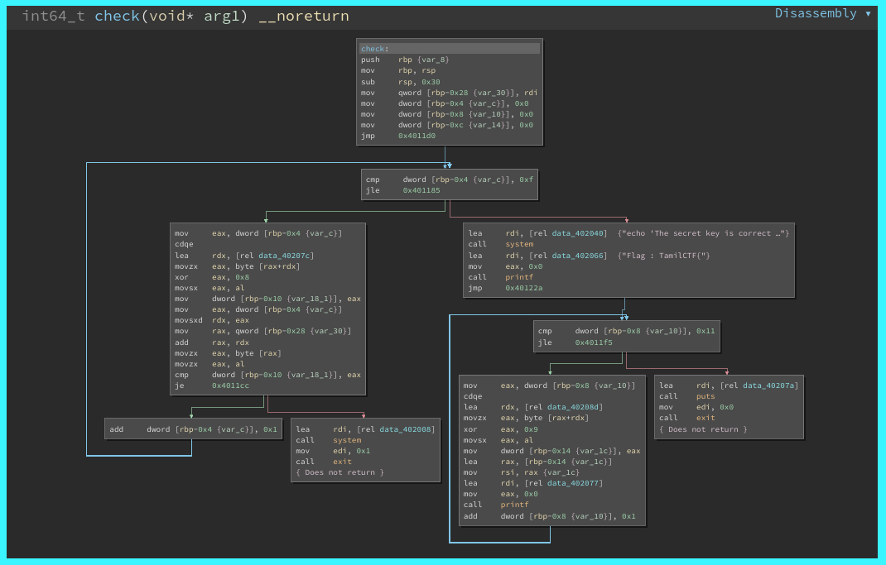

# RevEng Challenge
We need to find the flag in the form of TamilCTF{FLAG}.The challenge file is in the same directory: reveng. 

# Analysis The Binary
## Static Analysis
We can try some static analysis on reveng binary to get some basic information without run the program.

- Try **file** command:
  - file reveng

Its a 64 bit binary ,Dynamically linked and not stripped.

- Try **strings** command to find any like flag format:

  - strings reveng

  - Nothing interesting like flag **format** or **password**.

- Open the Binary in [Binary Ninja](https://binary.ninja/demo/).
  - /opt/binaryninja/binaryninja reveng

- Examine the main function:

  - In main function , it print some strings and get a input from user. (NOTE:They use fgets,so we can't overwrite the return address).
And it call the check function with parameter of user input.

- Examine the check function:

  - The check function contain two loops.The first loop compare something, its equal then iterate otherwise it exit the program.After the first loop, it goes to second loop and it look like generate the Flag.
(GOAL : FIND THE VALUES IN COMPARE STATEMENT)

- The First Loop:
  - First it compare to 0xf(it is hexa of 15).The iteration start with 0 and end with 15, So the length of strings is 16.
	
	

	

 
