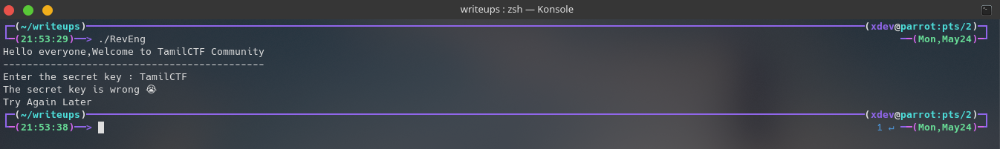
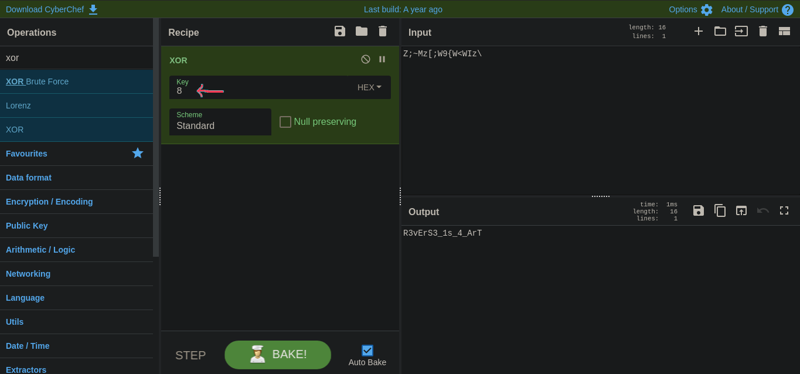
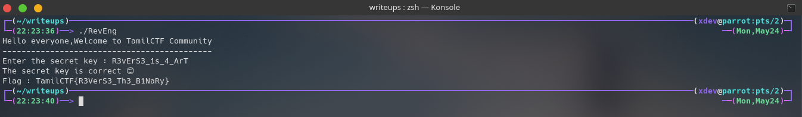

# RevEng Challenge
We need to find the flag in the form of TamilCTF{FLAG}.The challenge file is in the same directory: reveng. 

# Analysis The Binary

We can try some static analysis on reveng binary to get some basic information without run the program.

- Try **file** command:
  - file RevEng

Its a 64 bit binary ,Dynamically linked and not stripped.

- Try **strings** command to find any like flag format:

  - strings reveng

  - Nothing interesting like flag **format** or **password**.

- Run the Program:
  - ./RevEng
  
  - Ohh, the output is the ** secret key is wrong **

## Analysis the binary with binary ninja
- Open the Binary in [Binary Ninja](https://binary.ninja/demo/).
  - /opt/binaryninja/binaryninja reveng

- Examine the main function:

  - In main function , it print some strings and get a input from user. (NOTE:They use fgets,so we can't overwrite the return address).
And it call the check function with parameter of user input.

- Examine the check function:

  - The check function contain two loops.The first loop compare something, if its false,then it will exit the program.The second loop look like generate the Flag.
(GOAL : FIND THE VALUES IN COMPARE STATEMENT)

- The First Loop:
  - First it compare the **rbp-0x4{l_one}** ( the value of rbp-0x4{l_one} is 0 ) to 0xf **(it is hexa of 15)**.The iteration start with **0** and end with **15**, So the length of strings is **16**..The mov instruction move the iteration number to eax.Then load the data_40207c address **( Actually "Z;~Mz[;W9{W<\WIz\" strings stored in data_40207c )** into rdx. The single byte of rax (iteration value) + rdx (strings) moved into eax. Like if iteration is 0, the first value of strings is moved into eax. Then the value of eax is xor with 8 ,it stored in rbp-0x10{var_18_1}. So Finally it will compare to user input. **If the result of the comparsion is false ,it will exit the program.**

- The Second Loop:
  - It look like just generate a flag,then it will the program.It generate the flag as see in the first loop .It just xor the strings and produce the flag.

- Find the Secret Key by using [CyberChef](http://icyberchef.com/)
  - I use [cyberchef](http://icyberchef.com) to decode the strings.Search xor in cyberchef and enter the key (we know the strings are deccode with the value of 8 in the program ).Enter the encode value ("Z;~Mz[;W9{W<\WIz\") in input field and the output is R3vErS3_1s_4_ArT. So finally we got the secret key.

- Check the output is correct or wrong 
  - Run the binary and enter the decoded output. Hey we give the flag :smiley:
	

 
